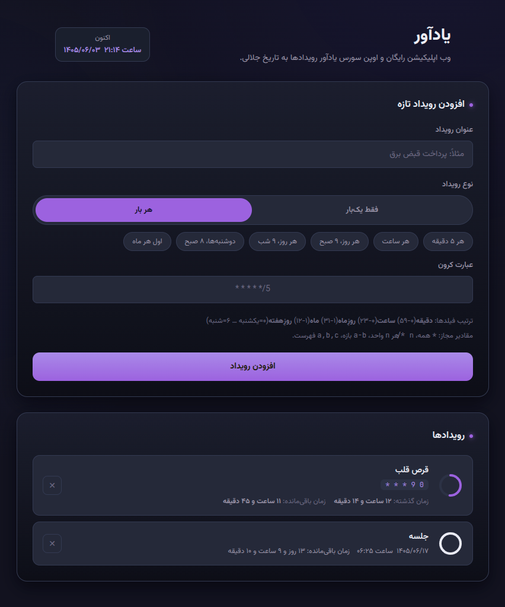
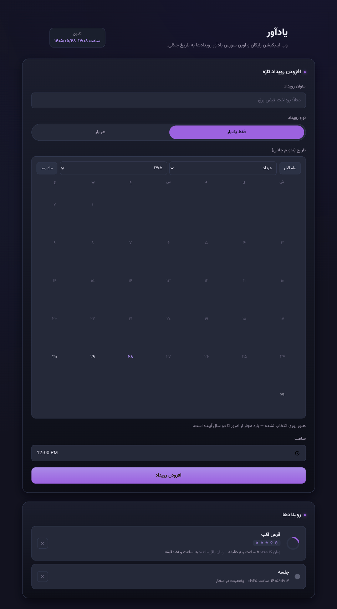

# Persian Reminder with Jalali Calendar

A modern, user-friendly Persian Jalali reminder website with integrated reminder system. Manage your events, track important dates, and never miss a deadline.

[View WebSite](https://hctilg.github.io/Reminder/)

## Screenshots

| Recurring Reminder | Once Reminder |
|---|---|
|  |  |

## Features

- **:calendar: Jalali Calendar Display** - Full Persian calendar with year/month/day navigation
- **:repeat: Cron-Like Scheduling!** - Schedule reminders using cron syntax for recurring events
- **:incoming_envelope: Notification** - Receive instant alerts for your events and reminders, ensuring you never miss anything
- **:memo: Event Management** - Create, edit, and delete events easily
- **:iphone: Responsive Design** - Works seamlessly on desktop and mobile
- **:new_moon: Nightly Theme** - Easy on the eyes during night usage
- **:floppy_disk: Local Storage** - Data saved locally on your device

## License

- [MIT License](LICENSE)
